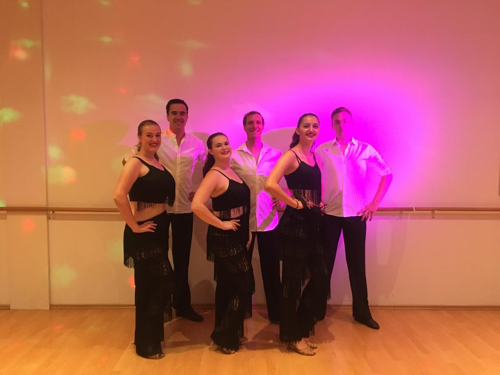
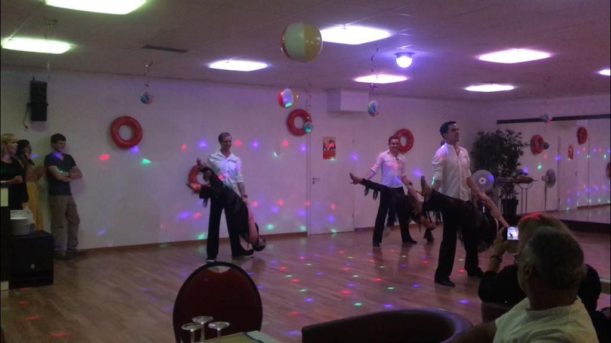

Bei nicht ganz so sommerlichen Temparaturen hat es die Cititanzschule Bühl bei ihrem gestrigen Sommerfest durch Palmen, Lampions, eine Cocktailbar, autenthische Dekoration und den Duft von Gegrilltem doch geschafft, ein bisschen Sommerfeeling in die kühleren Temparaturen zu bringen. 
Mit dieser fröhlichen Stimmung wurde die Lateinformation des TTC empfangen, als sie in den coolen Fransenlooks die Tanzschule betrat und sich für den Discofox aufstellte. Schnell ließ sich das tanzbegeisterte Publikum von den schnellen Drehungen, den komplizierten Wickelfiguren und vor allem den waghalsigen Posen begeistern und klatschte mit.

Der TTC Bühl bedankt sich bei der Cititanzschule für die wirklich gelungene Ausrichtung des Abends, die Einladung zu tanzen und das leckere Essen im Anschluss!